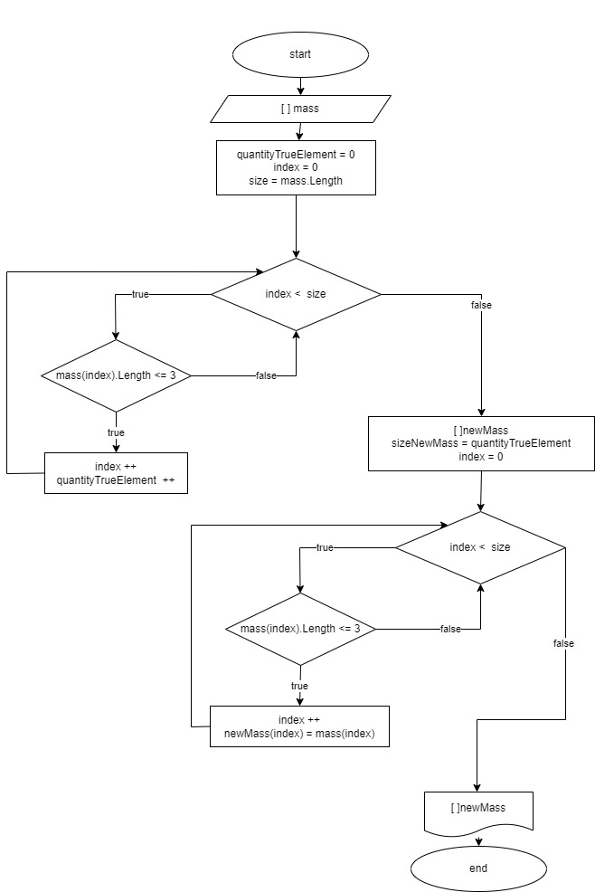

# **Описание методов  к заданию по преобразованию массива**
## ***Методы:***
* **GetLenthNewMass** - определяет количество элементов исходного массива которые    соответствуют требованиям для их включения в итоговый массив;
* **NewMass** - заполняет новый массив элементами исходного массива, которые соответствуют установленным требованиям;
* **PrintMass** - выводит элементы массива на консоль через запятую

## ***Алгоритм решения***
1. Пользователь вводит текст, набор символов ... из которого создается массив, элементы которго определяются через пробел по средствам  функции "Split"
1. Создаем новый пустой массив длина которого определяется методом "GetLenthNewMass" 
1. Заполняем итоговый массив описанным методом "NewMass"
1. Выводим результат на консоль

